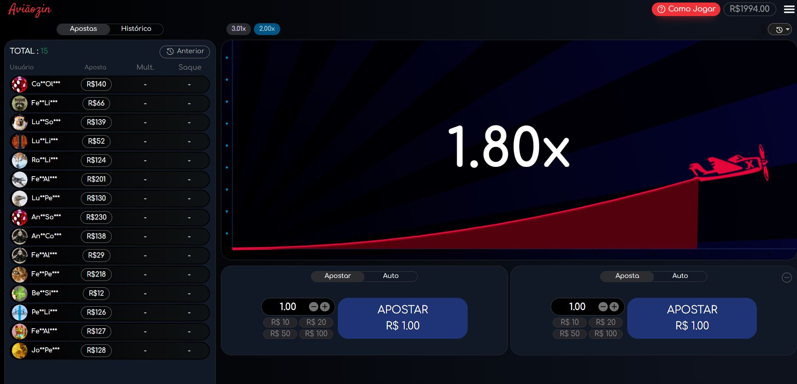

# ✈️ Jogo do Aviazin

Bem-vindo ao **Jogo do Aviazin**! 🎮 Este é um emocionante jogo estilo Aviator, onde você desafia a sorte e testa seus reflexos. Criado com 💻 **CodeIgniter 3** e **PHP 7.4**, o jogo utiliza **Canvas** no frontend para uma experiência dinâmica e interativa. 🚀



---

## DEMO URL
- https://jogodoaviao.games2api.xyz/play?token=d1d324eb4139d746845065e3f5e71675 (as vezes já foi de F).

## 🛠️ Funcionalidades

- **🎲 Sistema de apostas:** Teste sua sorte e veja até onde consegue ir antes do "crash"! 📈
- **📉 Gráfico dinâmico:** Visualize a curva em tempo real e saia antes que seja tarde demais.
- **💵 Multiplicadores emocionantes:** Ganhe mais quanto mais tempo aguentar (se for rápido o suficiente!).
- **🎨 Interface interativa:** Desenvolvida em Canvas para uma experiência fluida e responsiva.

---

## 🚀 Requisitos do sistema

- **PHP:** 7.4 ou superior
- **Servidor Web:** Nginx ou Apache
- **Banco de Dados:** MySQL
- **Bibliotecas:** CodeIgniter 3

---

## ⚙️ Configuração do projeto

1. Clone este repositório:
   ```bash
   git clone https://github.com/vitolike/jogo-do-aviazin.git
   ```

2. Navegue até o diretório do projeto:
   ```bash
   cd jogo-do-aviazin
   ```

3. Configure o arquivo `.env` com as credenciais do banco de dados:
   ```env
   # Banco de Dados
   DB_CONNECTION=mysqli
   DB_HOST=localhost
   DB_DATABASE=aviaozin
   DB_USERNAME=root
   DB_PASSWORD=
   ```

4. Importe o banco de dados:
   - O arquivo SQL pode ser encontrado na pasta `database/aviaozin.sql`.
   ```bash
   mysql -u root -p aviaozin < database/aviaozin.sql
   ```

5. Certifique-se de que as dependências do projeto estão instaladas.
   - Instale o Composer, se necessário:
     ```bash
     composer install
     ```

6. Configure o servidor:
   - Para Nginx, use uma configuração similar a:
     ```nginx
     server {
         listen 80;
         server_name localhost;
         root /caminho/para/jogo-do-aviazin;

         index index.php;

         location / {
             try_files $uri $uri/ /index.php?$query_string;
         }

         location ~ \.php$ {
             include snippets/fastcgi-php.conf;
             fastcgi_pass unix:/var/run/php/php7.4-fpm.sock;
             fastcgi_param SCRIPT_FILENAME $document_root$fastcgi_script_name;
             include fastcgi_params;
         }
     }
     ```

7. Execute o servidor local:
   ```bash
   php -S localhost:8000
   ```

---

## 🎮 Como jogar

1. Faça uma requisição POST para o endpoint:
   ```
   http://localhost
   ```

2. Use o seguinte corpo da requisição em JSON:
   ```json
   {
       "method": "game_launch",
       "agent_code": "admin",
       "agent_token": "token",
       "balance": 1000,
       "user_code": "test",
       "game_code": "sports",
       "lang": "pt"
   }
   ```

3. A resposta será semelhante a:
   ```json
   {
       "status": 1,
       "launch_url": "localhost/play?token=xxxx"
   }
   ```

4. Acesse a URL retornada no navegador para iniciar o jogo!

---

## 📂 Estrutura do projeto

```
|-- application/
|   |-- controllers/
|   |-- models/
|   |-- views/
|-- assets/
|   |-- css/
|   |-- js/
|   |-- images/
|-- database/
|   |-- aviaozin.sql
|-- .env
|-- index.php
|-- README.md
```

---

## ❤️ Contribuições

Contribuições são bem-vindas! Sinta-se à vontade para abrir issues ou enviar pull requests para melhorar o jogo. 🌟

---

## 📜 Licença

Este projeto está licenciado sob a [MIT License](LICENSE).
PARA USO NÃO COMERCIAL SÒ PARA FINS EDUCATIVOS.

---

## 📧 Contato

Se tiver dúvidas ou sugestões, envie um e-mail para: **victorcostaoliveira@gmail.com**

---

**Divirta-se e boa sorte no Jogo do Aviazin! ✈️**